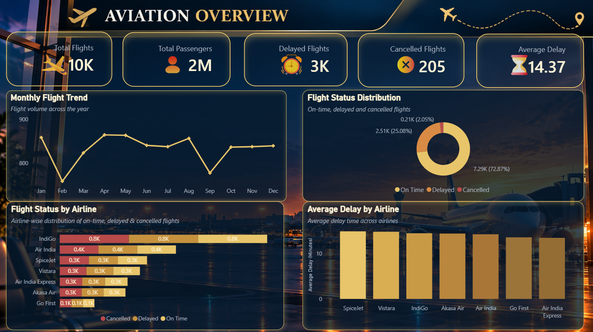
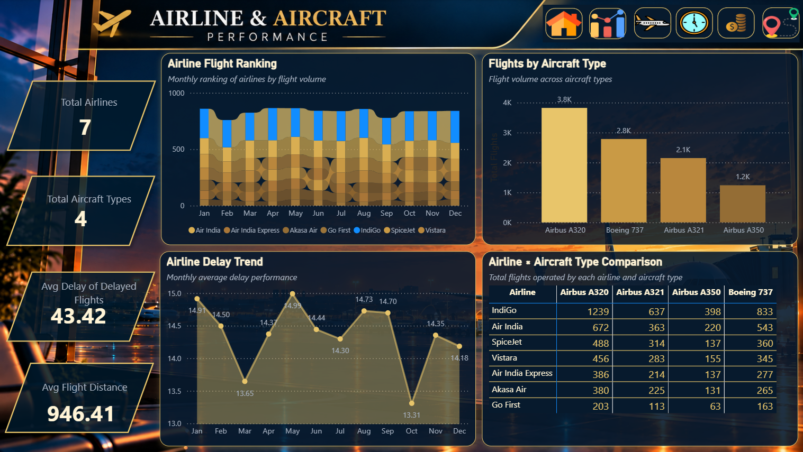
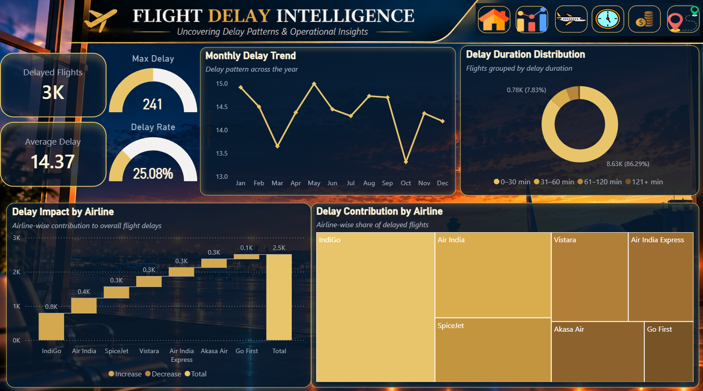
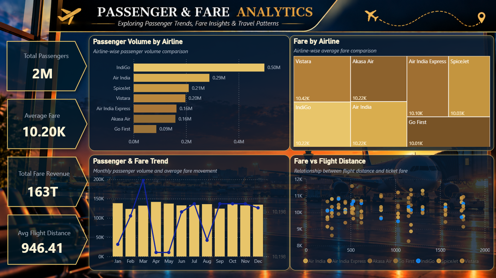
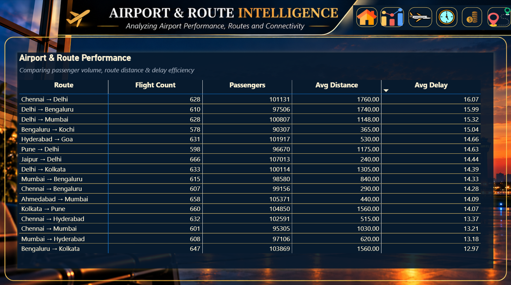

# ✈️ Aviation Performance Analytics

A Power BI project that analyzes flight performance, delays, airline operations, passenger trends, fares, and route performance using aviation data.

## 📊 Dashboard Preview

### 🏠 Home

### ✈️ Aviation Overview

### 🛫 Airline & Aircraft Performance

### ⏱️ Flight Delay Intelligence

### 💰 Passenger & Fare Analytics

### 🗺️ Airport & Route Intelligence

---

## 📌 About the Project

Aviation Performance Analytics is a Power BI dashboard created to explore and understand aviation data.

The project focuses on flight performance, airline and aircraft analysis, flight delays, passenger and fare trends, and airport and route performance.

The dashboard uses different charts, KPIs, and interactive visuals to make the data easier to understand.

---

## 🎯 Project Objectives

- Analyze overall flight performance.
- Compare flight volumes across airlines and aircraft types.
- Identify flight delay patterns.
- Compare passenger volumes and fares across airlines.
- Understand the relationship between fare and flight distance.
- Analyze route-wise flight performance.
- Present the data through interactive Power BI visuals.

---

## 🛠️ Tools & Technologies

- **Power BI** – Dashboard creation and data visualization
- **Power Query** – Data cleaning and transformation
- **DAX** – Measures and calculated columns
- **CSV** – Source dataset
- **GitHub** – Project documentation and version control

---

## 📂 Dataset

The project uses `Flight_Data.csv` as the source dataset.

The dataset includes information such as:

- Flight details
- Airline
- Aircraft type
- Flight status
- Delay minutes
- Passengers
- Ticket fare
- Flight distance
- Origin
- Destination

The CSV dataset is loaded into Power BI and used to create the dashboard visuals and calculations.

---

## 📑 Dashboard Pages

The dashboard contains six pages:

### 1. 🏠 Home

The Home page acts as the main navigation page for the dashboard. It provides access to the different analysis sections.

### 2. ✈️ Aviation Overview

This page gives an overall view of flight operations.

It includes:

- Total Flights
- Total Passengers
- Delayed Flights
- Cancelled Flights
- Average Delay
- Monthly flight trend
- Flight status distribution
- Airline-wise flight status
- Average delay by airline

### 3. 🛫 Airline & Aircraft Performance

This page focuses on airline and aircraft-level performance.

It includes:

- Total Airlines
- Total Aircraft Types
- Average Delay of Delayed Flights
- Average Flight Distance
- Airline flight ranking
- Flights by aircraft type
- Monthly airline delay trend
- Airline and aircraft comparison

### 4. ⏱️ Flight Delay Intelligence

This page focuses mainly on flight delays and their patterns.

It includes:

- Delayed Flights
- Average Delay
- Maximum Delay
- Delay Rate
- Monthly delay trend
- Delay duration analysis
- Delay impact by airline
- Airline-wise delay contribution

### 5. 💰 Passenger & Fare Analytics

This page analyzes passenger and fare-related information.

It includes:

- Total Passengers
- Average Fare
- Total Fare Revenue
- Average Flight Distance
- Passenger volume by airline
- Average fare by airline
- Monthly passenger and fare trend
- Fare vs distance analysis

### 6. 🗺️ Airport & Route Intelligence

This page provides a route-level view of aviation performance.

The table includes:

- Route
- Flight Count
- Passengers
- Average Distance
- Average Delay

This helps compare different routes based on their flight volume, passenger volume, distance, and delay.

---

## 📈 Key Insights

The dashboard can be used to explore:

- Flight volume and overall operational performance
- Flight status across airlines
- Airline and aircraft performance
- Monthly delay patterns
- Delay duration and airline contribution
- Passenger and fare trends
- Fare and distance relationship
- Route-wise flight performance

---

## 🚀 How to Use

1. Download or clone this repository.
2. Open `Aviation_Performance_Analytics.pbix` in Power BI Desktop.
3. Keep `Flight_Data.csv` in the project folder if you want to refresh the data.
4. Refresh the dataset if required.
5. Use the navigation buttons to move between dashboard pages.
6. Explore the KPIs, charts, and route analysis.

---

## 👩‍💻 Author

**Aarthi R**

B.E. Computer Science and Engineering

Interested in **Data Analytics, Artificial Intelligence, and Business Intelligence**.

---

⭐ If you find this project useful, feel free to explore the dashboard.
